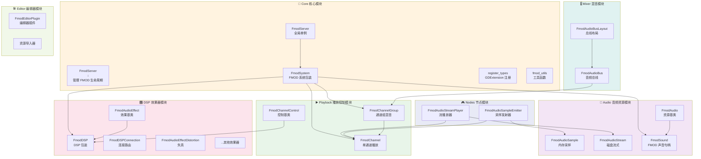
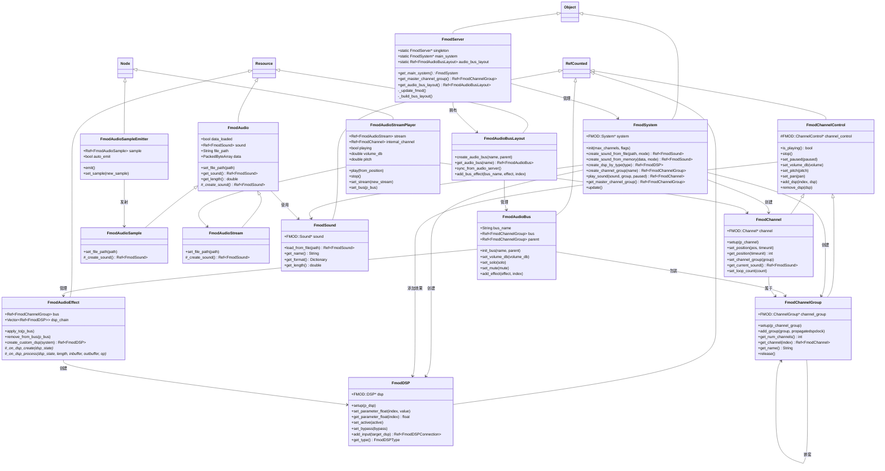
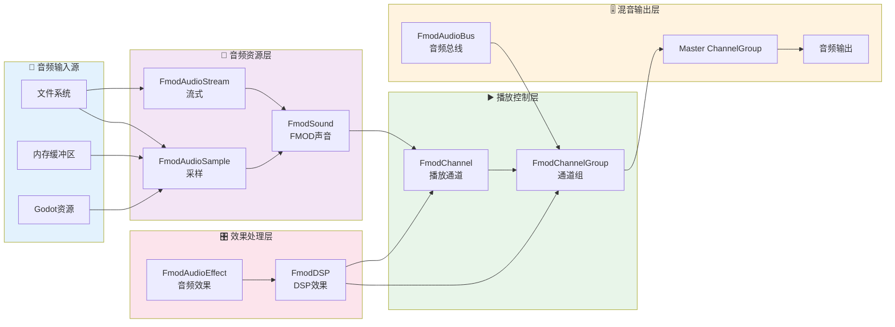
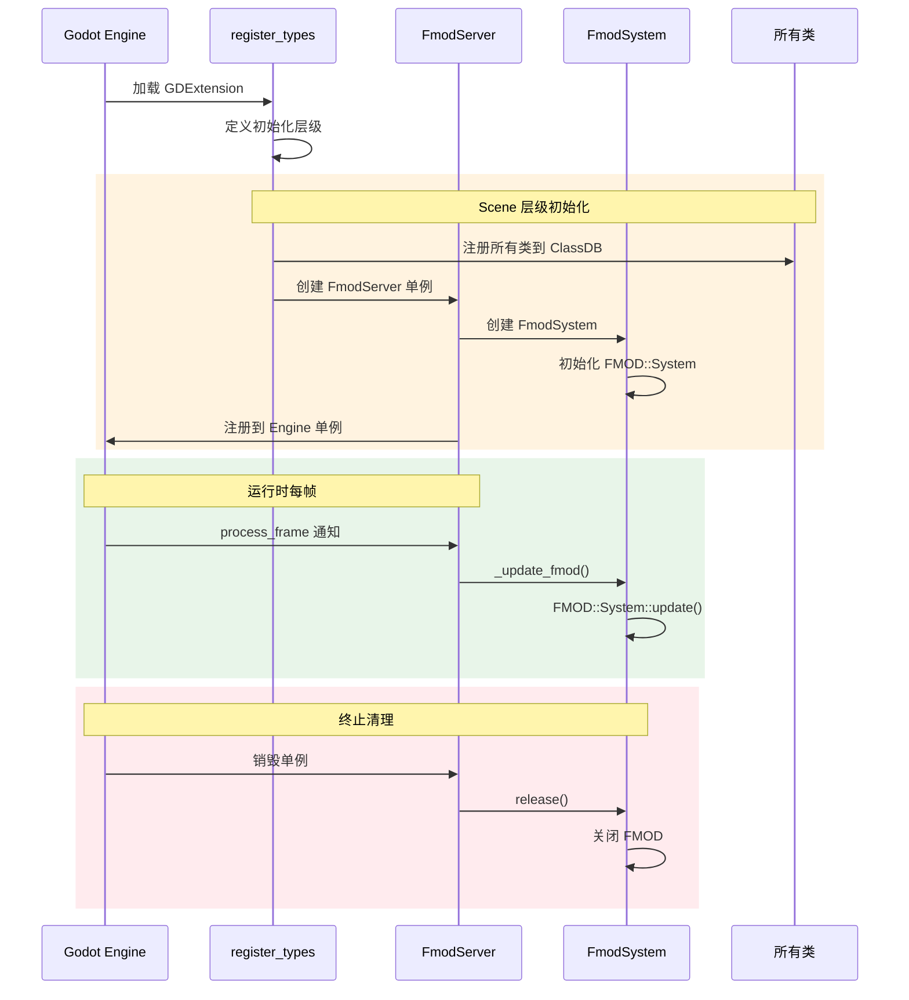
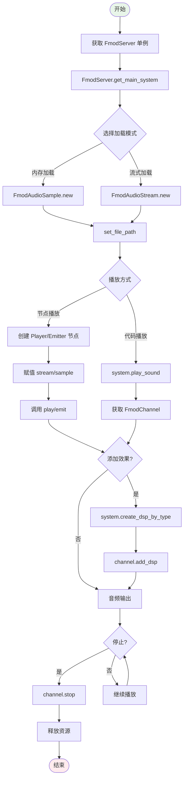

# Godot-FmodPlayer 代码架构图表

## 1. 整体类继承层次图

```mermaid
graph TB
    %% Godot 基础类
    Object[Godot Object]:::godot
    RefCounted[Godot RefCounted]:::godot
    Resource[Godot Resource]:::godot
    Node[Godot Node]:::godot
    EditorPlugin[Godot EditorPlugin]:::godot
    
    %% Core 模块
    FmodServer[FmodServer<br/>单例管理]:::core
    FmodSystem[FmodSystem<br/>FMOD系统包装]:::core
    
    %% Playback 模块
    FmodChannelControl[FmodChannelControl<br/>抽象基类]:::playback
    FmodChannel[FmodChannel<br/>通道控制]:::playback
    FmodChannelGroup[FmodChannelGroup<br/>通道组/混音]:::playback
    
    %% Audio 模块
    FmodSound[FmodSound<br/>声音资源]:::audio
    FmodAudio[FmodAudio<br/>音频资源抽象]:::audio
    FmodAudioSample[FmodAudioSample<br/>采样音频]:::audio
    FmodAudioStream[FmodAudioStream<br/>流式音频]:::audio
    
    %% DSP 模块
    FmodDSP[FmodDSP<br/>DSP效果器]:::dsp
    FmodDSPConnection[FmodDSPConnection<br/>DSP连接]:::dsp
    FmodAudioEffect[FmodAudioEffect<br/>效果抽象基类]:::dsp
    FmodAudioEffectDistortion[FmodAudioEffectDistortion<br/>失真效果]:::dsp
    
    %% Mixer 模块
    FmodAudioBus[FmodAudioBus<br/>音频总线]:::mixer
    FmodAudioBusLayout[FmodAudioBusLayout<br/>总线布局]:::mixer
    
    %% Nodes 模块
    FmodAudioStreamPlayer[FmodAudioStreamPlayer<br/>流播放器节点]:::nodes
    FmodAudioSampleEmitter[FmodAudioSampleEmitter<br/>采样发射器节点]:::nodes
    
    %% Editor 模块
    FmodEditorPlugin[FmodEditorPlugin<br/>编辑器插件]:::editor
    
    %% 继承关系
    Object --> FmodServer
    Object --> FmodSystem
    Object --> FmodEditorPlugin
    
    RefCounted --> FmodChannelControl
    RefCounted --> FmodSound
    RefCounted --> FmodDSP
    RefCounted --> FmodDSPConnection
    RefCounted --> FmodAudioBus
    
    FmodChannelControl --> FmodChannel
    FmodChannelControl --> FmodChannelGroup
    
    Resource --> FmodAudio
    FmodAudio --> FmodAudioSample
    FmodAudio --> FmodAudioStream
    
    Resource --> FmodAudioEffect
    FmodAudioEffect --> FmodAudioEffectDistortion
    
    Resource --> FmodAudioBusLayout
    
    Node --> FmodAudioStreamPlayer
    Node --> FmodAudioSampleEmitter
    
    EditorPlugin --> FmodEditorPlugin
    
    classDef godot fill:#e1f5ff,stroke:#01579b,stroke-width:2px
    classDef core fill:#fff3e0,stroke:#e65100,stroke-width:2px
    classDef playback fill:#e8f5e9,stroke:#2e7d32,stroke-width:2px
    classDef audio fill:#f3e5f5,stroke:#6a1b9a,stroke-width:2px
    classDef dsp fill:#fce4ec,stroke:#c2185b,stroke-width:2px
    classDef mixer fill:#e0f2f1,stroke:#00695c,stroke-width:2px
    classDef nodes fill:#e8eaf6,stroke:#303f9f,stroke-width:2px
    classDef editor fill:#f1f8e9,stroke:#558b2f,stroke-width:2px
```



## 2. 模块组织结构图



## 3. 核心类关系详细图



## 4. 数据流图



## 5. GDExtension 注册流程图



## 6. 文件组织结构图

```
src/
├── core/                           # 核心系统
│   ├── register_types.h/.cpp       # GDExtension 注册入口
│   ├── fmod_server.h/.cpp          # 全局单例管理
│   ├── fmod_system.h/.cpp          # FMOD 系统包装
│   └── fmod_utils.hpp              # 工具宏和函数
│
├── audio/                          # 音频资源
│   ├── fmod_audio.h/.cpp           # 音频资源基类
│   ├── fmod_audio_sample.h/.cpp    # 采样音频（内存加载）
│   ├── fmod_audio_stream.h/.cpp    # 流式音频（磁盘加载）
│   └── fmod_sound.h/.cpp           # FMOD 声音句柄
│
├── playback/                       # 播放控制
│   ├── fmod_channel_control.h/.cpp # 通道控制基类
│   ├── fmod_channel.h/.cpp         # 单通道播放
│   └── fmod_channel_group.h/.cpp   # 通道组/混音
│
├── dsp/                            # 数字信号处理
│   ├── fmod_dsp.h/.cpp             # DSP 效果器包装
│   ├── fmod_dsp_connection.h/.cpp  # DSP 连接
│   ├── fmod_audio_effect.h/.cpp    # 效果基类
│   └── fmod_audio_effect_*.h/.cpp  # 各种效果实现
│       ├── distortion              # 失真
│       ├── reverb                  # 混响
│       ├── delay                   # 延迟
│       ├── eq                      # 均衡器
│       └── ...                     # 其他效果
│
├── mixer/                          # 混音系统
│   ├── fmod_audio_bus.h/.cpp       # 音频总线
│   └── fmod_audio_bus_layout.h/.cpp# 总线布局
│
├── nodes/                          # Godot 节点
│   ├── fmod_audio_stream_player.h/.cpp   # 流播放器节点
│   └── fmod_audio_sample_emitter.h/.cpp  # 采样发射器节点
│
├── editor/                         # 编辑器插件
│   ├── fmod_editor_plugin.h/.cpp   # 编辑器插件
│   ├── fmod_audio_importer.h/.cpp  # 资源导入器
│   └── fmod_audio_import_data.h/.cpp     # 导入数据
│
└── thirdparty/fmod/                # FMOD SDK
    ├── inc/                        # 头文件
    └── lib/                        # 库文件
        ├── x64/                    # Windows x64
        ├── android/                # Android
        └── ...
```

## 7. 类关系矩阵

| 类名 | 继承自 | 主要功能 | 依赖的类 |
|------|--------|----------|----------|
| **FmodServer** | Object | 全局单例，管理 FMOD 生命周期 | FmodSystem, FmodAudioBusLayout |
| **FmodSystem** | Object | FMOD::System 包装，创建声音/通道/DSP | FmodSound, FmodChannel, FmodChannelGroup, FmodDSP |
| **FmodChannelControl** | RefCounted | Channel/ChannelGroup 抽象基类 | FmodDSP |
| **FmodChannel** | FmodChannelControl | 单声音播放控制 | FmodSound, FmodChannelGroup |
| **FmodChannelGroup** | FmodChannelControl | 通道组混音 | FmodChannel |
| **FmodSound** | RefCounted | FMOD::Sound 包装 | - |
| **FmodAudio** | Resource | 音频资源抽象基类 | FmodSound |
| **FmodAudioSample** | FmodAudio | 内存加载音频 | FmodSystem |
| **FmodAudioStream** | FmodAudio | 流式加载音频 | FmodSystem |
| **FmodDSP** | RefCounted | DSP 效果包装 | FmodDSPConnection |
| **FmodDSPConnection** | RefCounted | DSP 连接 | FmodDSP |
| **FmodAudioEffect** | Resource | 自定义效果基类 | FmodDSP, FmodChannelGroup |
| **FmodAudioBus** | RefCounted | 音频总线 | FmodChannelGroup, FmodAudioEffect |
| **FmodAudioBusLayout** | Resource | 总线布局管理 | FmodAudioBus |
| **FmodAudioStreamPlayer** | Node | 流播放器节点 | FmodAudioStream, FmodChannel |
| **FmodAudioSampleEmitter** | Node | 采样发射器节点 | FmodAudioSample, FmodChannel |

## 8. 使用流程图



---

> 💡 **提示**: 此架构图基于代码分析生成，展示了 Godot-FmodPlayer 项目的整体结构和类之间的关系。
